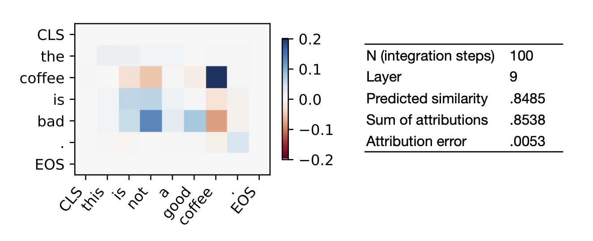

# An Attribution Method for Siamese Encoders

This repository contains the code to the paper *An Attribution Method for Siamese Encoders* published at *EMNLP'23*.
You can find the full paper in the ACL Antology and on [arXiv](https://arxiv.org/abs/2310.05703).

## Main Results
It provides a method to attribute predictions of Siamese Encoders like sentence transformers to their inputs or intermediate representations.\
The output takes the form of a feature-pair matrix and can be reduced to a token--token matrix in the case of transformers. For some examples see below.\
Attributions are theoretically guaranteed to sum up to the total model prediction. Therefore, they *faithfully* explain which combinations of features in the two inputs the model looks at for individual predictions.\
The accuracy of attributions depends on a parameter *N* and we can measure it exactly case by case.

## Installation
You can use this code by cloning the repository and running
`pip install .` inside the directory.\
We recommend using Python 3.8 or higher.

## Getting Started

**Demo**

The `demo.ipynb` notebook contains a demo to load a model and compute attributions for a pair of sentences. It also introduces the most important classes and methods.

**Models**

We provide two models. Both are fined-tuned from pre-trained sentence-transformers:
- [*xs_mpnet*](https://www2.ims.uni-stuttgart.de/data/xsbert/xs_mpnet.zip) is fine-tuned off the 12-layer [all-mpnet-base-v2](https://huggingface.co/sentence-transformers/all-mpnet-base-v2) model.
- [*xs_droberta*](https://www2.ims.uni-stuttgart.de/data/xsbert/xs_distilroberta.zip) is based on the shallower 4-layer [all-distillroberta-v1](https://huggingface.co/sentence-transformers/all-distilroberta-v1) model.

You can use the `models.load_model()` method to download and initialize either of these models as shown in the demo notebook.
Alternatively, you can also download the checkpoints by clicking the above links, unpack them, and initialize the `models.XSMPNet` or `models.XSRoberta` class from them.

**Fine-Tuning**

You can also fine-tune your own models with the `train.py` script.\
For a good performance, we recommend to start trainings off pre-trained [sentence-transformers](https://www.sbert.net/docs/pretrained_models.html). But vanilla transformers technically also work.
For the time being we support MPNet and RoBERTa architectures.
In the example, we use the [STS-benchmark](https://aclanthology.org/S17-2001/) dataset, but any other dataset containing pairs of text works.

## Citation

If you use this code for academic work, please cite our paper.

## Implementation
Our Implementation builds up on the [sentence-transformers](https://github.com/UKPLab/sentence-transformers) package.

## License