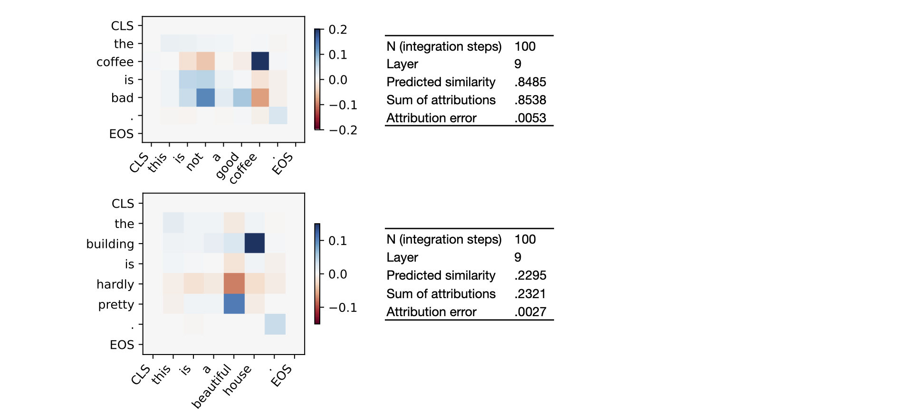

# An Attribution Method for Siamese Encoders

This repository contains the code to the **EMNLP'23** paper [*An Attribution Method for Siamese Encoders*](https://aclanthology.org/2023.emnlp-main.980) ([arXiv](https://arxiv.org/abs/2310.05703)) and the follow-up work [*Approximate Attributions for Off-the-Shelf Siamese Transformers*](https://aclanthology.org/2024.eacl-long.125/) ([arXiv](https://arxiv.org/abs/2402.02883)) published at **EACL'24**.

## Main Results
Our method provides a way to attribute individual predictions of Siamese encoders like sentence transformers to features of their inputs or intermediate representations.\
The outputs take the form of feature-pair matrices and can be reduced to token-token matrices in the case of transformers.

We have two types of attributions:\
**Exact attributions** are theoretically guaranteed to sum up to the total model prediction and we can measure their accuracy exactly case by case. However, they require fine-tuning of the model for a small number of steps (EMNLP paper).
The predictive perfromance of our (cosine-based) models with exact attribution ability is on par with standard models.\
**Approximate attributions** are directly applicable to off-the-shelf models but lose theoretical guarantees for correctness. Nevertheless, we find that they often agree with their exact counterparts for deeper intermediate representations (EACL paper).

The examples below, visualize our (exact) pair-wise attributions to token representations in the given layer. The tables show the predicted similarities, the total sum of attributions and the attribution error for *N* integration steps (see EMNLP paper).



## Installation
You can use this code by cloning the repository and running
`pip install .` inside the directory.\
We recommend using Python 3.8 or higher.

## Getting Started

**Demos**

The `demo_exact_model.ipynb` notebook loads one of our models with exact attribution ability and computes attributions for a pair of sentences. It also introduces the most important classes and methods.
The `demo_shelf_model.ipynb` notebook loads an off-the-shelf model from huggingface and directly computes approximate attributions for the unmodified model.

**Models**

We provide different fine-tuned models with exact attribution ability:
- [*mpnet_cos*](https://www2.ims.uni-stuttgart.de/data/xsbert/mpnet_cos.zip) is fine-tuned off the 12-layer [all-mpnet-base-v2](https://huggingface.co/sentence-transformers/all-mpnet-base-v2) model.
- [*droberta_cos*](https://www2.ims.uni-stuttgart.de/data/xsbert/droberta_cos.zip) is based on the shallower 4-layer [all-distillroberta-v1](https://huggingface.co/sentence-transformers/all-distilroberta-v1) model.
- Both models are also available with a dot-product similarity measure ([*mpnet_dot*](https://www2.ims.uni-stuttgart.de/data/xsbert/mpnet_dot.zip), [*droberta_dot*](https://www2.ims.uni-stuttgart.de/data/xsbert/droberta_dot.zip)). But the cosine-based models have better predictive performances and should be preferred.

You can use the `models.load_model()` method to download and initialize either of these models as shown in the demo notebook.
Alternatively, you can also download the checkpoints by clicking the above links, unpack them, and initialize the `models.XSMPNet` or `models.XSRoberta` class from them. 

**Fine-Tuning**

You can also fine-tune your own exact models with the `train.py` script.\
For a good performance, we recommend to start trainings off pre-trained [sentence-transformers](https://www.sbert.net/docs/pretrained_models.html). But vanilla transformers technically also work.
For the time being we support MPNet and RoBERTa architectures.
In the example, we use the [STS-benchmark](https://aclanthology.org/S17-2001/) dataset for fine-tuning, but any other dataset containing annotated text-pairs works.

## Citation

If you use this code for academic work, please cite our papers

```bibtex
@inproceedings{moeller-etal-2023-attribution,
    title = "An Attribution Method for Siamese Encoders",
    author = "Moeller, Lucas and Nikolaev, Dmitry and Pad{\'o}, Sebastian",
    booktitle = "Proceedings of the 2023 Conference on Empirical Methods in Natural Language Processing",
    year = "2023",
    address = "Singapore",
    publisher = "Association for Computational Linguistics",
    url = "https://aclanthology.org/2023.emnlp-main.980",
    doi = "10.18653/v1/2023.emnlp-main.980",
    pages = "15818--15827"
}

@inproceedings{moeller-etal-2024-approximate,
    title = "Approximate Attributions for Off-the-Shelf Siamese Transformers",
    author = "Moeller, Lucas and Nikolaev, Dmitry and Pad{\'o}, Sebastian",
    booktitle = "Proceedings of the 18th Conference of the European Chapter of the Association for Computational Linguistics (Volume 1: Long Papers)",
    year = "2024",
    address = "St. Julian{'}s, Malta",
    publisher = "Association for Computational Linguistics",
    url = "https://aclanthology.org/2024.eacl-long.125",
    pages = "2059--2071",
}
```

## Implementation
Our Implementation builds upon the [sentence-transformers](https://github.com/UKPLab/sentence-transformers) package.
